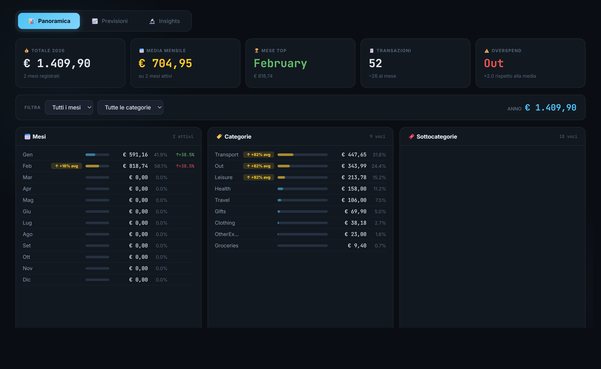
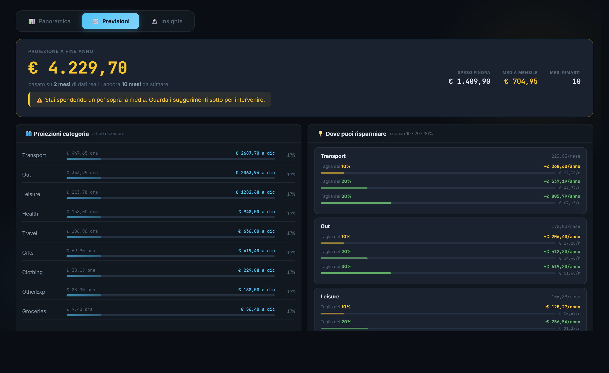
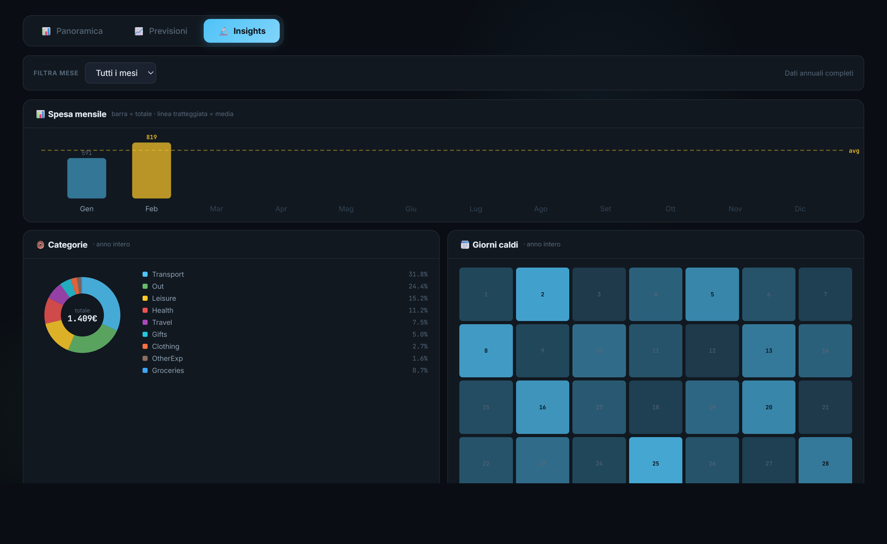

# 💰 Personal Expenses

> Desktop app per tracciare, analizzare e prevedere le spese personali — dark UI, zero abbonamenti.

[](https://react.dev)
[](https://electronjs.org)
[](https://vitejs.dev)
[](https://appwrite.io)
[](https://tailwindcss.com)

---

## 📸 Screenshots

| Panoramica | Previsioni | Insights |
|---|---|---|
|  |  |  |

> Gli screenshot sono generati con Remotion — vedi sezione [Video demo](#-renderizzare-il-video-demo).

---

## 🎬 Video demo

https://github.com/Mikes-not-found/personal-expenses/raw/main/video/out/demo.mp4

> Oppure renderizza il video localmente:
> ```bash
> cd video && npm install && npm run render
> ```

---

## ✨ Features

### 📊 Panoramica in tempo reale
- **5 KPI cards**: Totale anno, Media mensile, Mese con più spesa, Numero transazioni, Overspend
- **Breakdown Mesi / Categorie / Sottocategorie** su tre colonne affiancate
- **Alert contestuali**: badge `+X% avg` che mostra quanto sei sopra la tua media reale (non un limite arbitrario)
- **Confronto mese su mese (MoM)**: ↑↓ con delta percentuale per ogni mese
- **Filtri**: per mese e categoria, con totale filtrato in tempo reale

### 📈 Previsioni
- **Proiezione fine anno**: calcolo basato sulla media dei mesi con dati reali
- **Frasi motivazionali**: messaggi personalizzati in base al tuo ritmo di spesa
- **Proiezioni per categoria**: barra progresso "ora → dicembre"
- **Savings tips 10/20/30%**: per ogni categoria, tre scenari di riduzione con risparmio mensile e annuale

### 🔬 Insights & Grafici
- **Bar chart mensile** (SVG inline): confronta i 12 mesi con linea media tratteggiata
- **Donut chart categorie**: distribuzione percentuale con legenda
- **Heatmap giorni del mese**: intensità di spesa per ogni giorno 1–31
- **Ticket medio per categoria**: importo medio per singola transazione
- **Filtro mese**: tutti i grafici Insights si filtrano sul mese selezionato

### 🎨 Design
- Dark UI con palette blu-ciano su sfondo `#0a0e14`
- JetBrains Mono per i numeri, Inter per il testo
- CSS animations native (no librerie esterne): `barGrow`, `slideDown`, `fadeIn`, `countUp`
- Sfondo animato con simboli finanziari flottanti e orb luminosi
- Tab navigation a tre sezioni: nessuno scroll verticale tra sezioni

---

## 🛠 Stack tecnico

| Layer | Tecnologia |
|-------|-----------|
| UI Framework | React 19 |
| Desktop shell | Electron 40 |
| Build tool | Vite 6 |
| Styling | Tailwind CSS 4 + CSS custom properties |
| Backend / DB | Appwrite Cloud |
| Charts | SVG inline (no librerie chart) |
| Video demo | Remotion 4 |

---

## 🚀 Avvio rapido

### Prerequisiti
- Node.js 18+
- Account [Appwrite](https://appwrite.io) con un database configurato

### Configurazione

1. Clona il repo e installa le dipendenze:
```bash
git clone https://github.com/Mikes-not-found/personal-expenses.git
cd personal-expenses
npm install
```

2. Crea il file `.env` nella root:
```env
VITE_APPWRITE_ENDPOINT=https://cloud.appwrite.io/v1
VITE_APPWRITE_PROJECT_ID=il-tuo-project-id
VITE_APPWRITE_DATABASE_ID=il-tuo-database-id
VITE_APPWRITE_COLLECTION_ID=il-tuo-collection-id
```

3. Avvia in modalità sviluppo:
```bash
# Solo web (Vite)
npm run dev

# Con Electron
npm run electron:dev
```

### Build

```bash
# Build web
npm run build

# Build installer Windows (.exe)
npm run electron:build
```

---

## 📁 Struttura del progetto

```
personal-expenses/
├── electron/                        # Electron main process
├── src/
│   ├── components/
│   │   ├── AnimatedBackground.jsx   # Sfondo particelle finanziarie
│   │   ├── InsightsPanel.jsx        # Grafici SVG (bar, donut, heatmap)
│   │   ├── PredictionsPanel.jsx     # Previsioni anno + savings tips
│   │   ├── ProgressBar.jsx          # Righe spesa con barre e alert
│   │   └── StatsGrid.jsx            # 5 KPI cards
│   ├── utils/
│   │   └── predictions.js           # Tutta la logica di calcolo
│   ├── views/
│   │   └── Dashboard.jsx            # Layout con tab navigation
│   └── constants/
│       └── categories.js            # Categorie e costanti
├── video/                           # Progetto Remotion per il demo
│   └── src/compositions/
│       └── AppDemo.tsx              # 5 scene animate (18 secondi)
└── screenshots/                     # Screenshot generati con Remotion
```

---

## 🎬 Renderizzare il video demo

Il video è creato con [Remotion](https://remotion.dev) — React per i video.

```bash
cd video
npm install

# Apri lo studio Remotion (preview interattivo)
npm run start

# Renderizza il video MP4 (out/demo.mp4)
npm run render

# Genera screenshot PNG (frame 30 / 120 / 220)
npm run screenshot
```

Il video mostra **5 scene** (18 secondi totali a 30fps):

| # | Scena | Frame | Durata |
|---|-------|-------|--------|
| 1 | Intro — Logo animato | 0–70 | 2.3s |
| 2 | Panoramica — KPI + breakdown | 70–220 | 5s |
| 3 | Previsioni — Proiezione + savings tips | 220–380 | 5.3s |
| 4 | Insights — Bar chart, donut, heatmap | 380–490 | 3.7s |
| 5 | Outro — Feature summary | 490–560 | 2.3s |

---

## 📄 Licenza

MIT — libero di usare, modificare e distribuire.
